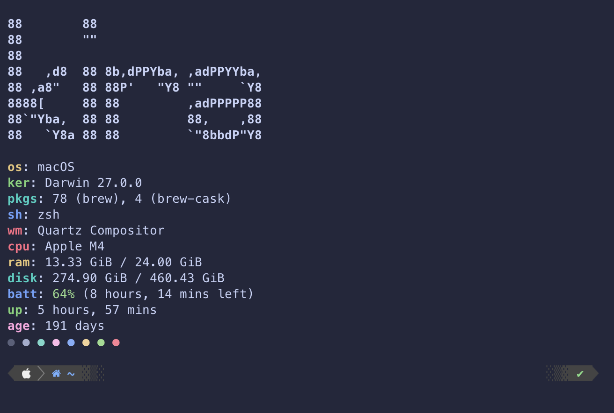

# macOS Dotfiles

My personal macOS customization dotfiles and terminal configuration. 

> **Note:** These configurations are tailored to my specific machine and preferences. I provide no guarantees that they will all work perfectly on your system. Please review the files before applying them to your machine.

## Requirements

To fully replicate this setup, ensure you have the following dependencies installed:

### Terminal & Shell
* **[iTerm2](https://iterm2.com/)**: Terminal emulator for macOS.
  * *Color Scheme:* [Catppuccin Macchiato](https://github.com/catppuccin/iterm)
* **[Oh My Zsh](https://ohmyz.sh/)**: Framework for managing Zsh configuration.
* **[Powerlevel10k](https://github.com/romkatv/powerlevel10k)**: A fast and flexible Zsh theme.
  * *Color Scheme:* Catppuccin Macchiato for p10k/zsh [I used this one](https://github.com/spencerfrost/powerlevel10k)

### CLI Utilities
* **[Fastfetch](https://github.com/fastfetch-cli/fastfetch)**: Command-line system information tool.
* **[FIGlet](http://www.figlet.org/)**: Utility for creating ASCII text banners.

## Installation
1. Clone this repository to your local machine:
   `git clone https://github.com/pipbug/dotfiles.git`
2. Install the required dependencies (can generally be done via Homebrew: `brew install fastfetch iterm2 figlet`).
4. Install Oh-My-Zsh and powerlevel10k, following the configuration wizards.
3. Import the Catppuccin Macchiato color scheme into iTerm2.
4. Copy or symlink the configuration files (like .zshrc, .p10k.zsh, .config) to your home directory. Make sure to back up any existing configurations first.

You can change the ASCII-art logo at the top of fastfetch by modifying ~/.config/fastfetch/config.jsonc
